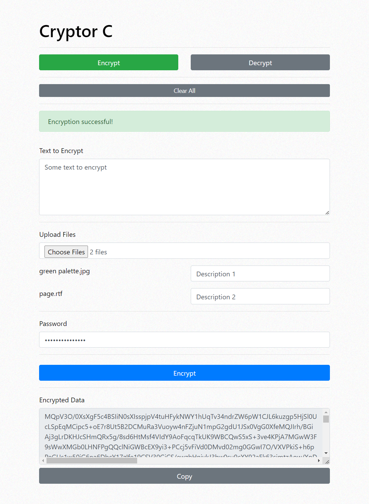
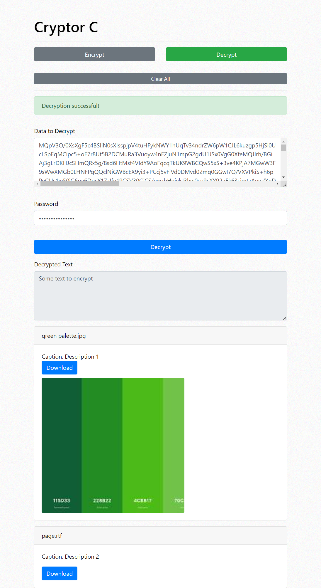

# Cryptor C

Cryptor C is a client-side encryption and decryption tool built with ReactJS and Bootstrap. It enables users to encrypt text and files using AES-GCM encryption with a password, and decrypt them locally without sending any data to a server.

## Features

- Encrypt text and files (including images).
- Decrypt encrypted data using the password.
- Supports uploading multiple files with captions.
- Outputs encrypted data as a Base64 string.

## Usage

1. **Encrypt Tab**:
   - Enter text to encrypt in the textarea.
   - Upload files (images or other types).
   - Set a password for encryption.
   - Click the "Encrypt" button to encrypt the data.

2. **Decrypt Tab**:
   - Paste or enter the encrypted data.
   - Enter the password used for encryption.
   - Click the "Decrypt" button to view decrypted text and download files.

## Security

Cryptor C operates entirely on the client side. No data is transmitted to a server, ensuring user privacy and security.

## Live Demo

Try out Cryptor C online at [https://elysiummob.com/cryptor](https://elysiummob.com/cryptor).

## Screenshots

*Encrypt Tab - Encrypt text and files.*

*Decrypt Tab - Decrypt encrypted data and view files.*